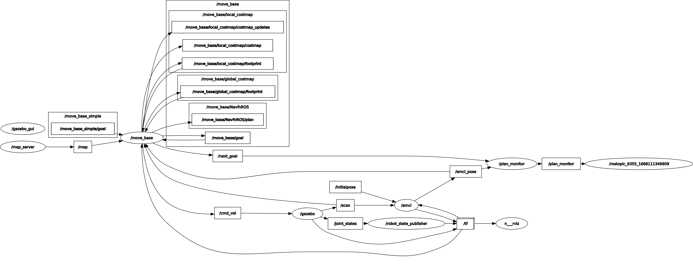

# RTRLocalPlanner
Rotate-Translate-Rotate algorithm for move_base local planner. Implements nav_core::BaseLocalPlanner.

It is a simple local planner that follows the global plan as it is by first rotating to face the goal point, then translating to the goal point and then repeating until
the final goal point when it rotates to orient to the given goal pose.

## Tested enviornment

The code was tested in a turtlebot3 simulation environment with the burger model. The package was built and tested inside of a ROSject in <https://theconstructsim.com>. You can find the exact ROSject used by going to the Featured ROSjects in my profile:
<https://app.theconstructsim.com/Profile/aj.sampathk>

## Building

### Dependencies and environment

In order to build this package, set up a turtlebot3 environment by cloning and building the following three repositories in a workspace.

> * <https://github.com/ROBOTIS-GIT/turtlebot3>
> * <https://github.com/ROBOTIS-GIT/turtlebot3_simulations>
> * <https://github.com/ROBOTIS-GIT/turtlebot3_msgs>

### Building packages

Then, from the root directory of your workspace:

```
 cd src/turtlebot3
 git clone https://github.com/ajsampathk/RTRLocalPlanner.git
 rospack profile
 catkin_make
```
This will build all the packages in the workspace. Make sure you have any additional dependancy required to run the turtlebot3 packages.

## Adding Planner to move_base

In order to add the planner to move_base when running the navigation stack, we need to edit [this launch file](https://github.com/ROBOTIS-GIT/turtlebot3/blob/master/turtlebot3_navigation/launch/move_base.launch) in the turtlebot3_navigation/launch directory. By default, the launch file will be written to load the DWAPlanner. We need to replace that with the RTRLocalPlanner. So open the file and find this line under the move_base node params:

```   
<param name="base_local_planner" value="dwa_local_planner/DWAPlannerROS" />
```

And replace it with:

```
<param name="base_local_planner" value="rtr_local_planner/RTRLocalPlanner" />
```

This should allow the RTRLocalPlanner to be initialized when move_base in launched.
**Note:** You can also remove or comment any other params/lines that are related to DWA Planner.

## Running 

Once the launch file is modified, it is time to run the nodes. It is best to follow this order when launching the nodes:

> `roslaunch turtlebot3_gazebo turtlebot3_world.launch #start gazebo simulation`


> `roslaunch turtlebot3_navigation turtlebot3_navigation.launch #start navigation stack`


> `rosrun rtr_local_planner plan_monitor_node #start rtr plan monitor`

***NOTE:*** This is assuming you have a valid map, if you're not sure how to build and load a map, I recommend following [this tutorial](https://www.theconstructsim.com/ros-qa-191-how-to-load-a-pre-built-map-into-ros-for-the-navigation-stack/).

Also note that `export TURTLEBOT3_MODEL=burger` should be executed before launching the first two launch files if running from two different terminals.

## Tests

Although it is not too complicated, there are some unit tests associated with the numerical calculations used in the RTR Planner. You can run all these tests by simply running the follwoing command from the workspace root directory:
```
catkin_make run_tests
```


## Results

>***Use the rviz param file in the rviz folder to load the same settings as seen in the image.***

## RQT Graph

